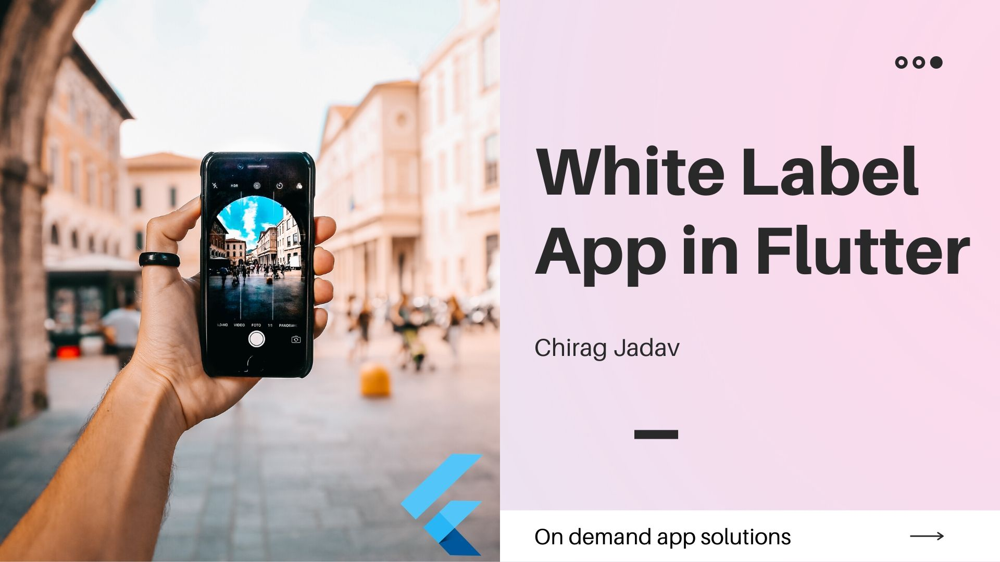

# whitelabel-app

<h1 align="center">
   
  White Label App in Flutter
</h1>

  

White-label products and services are re-brandable, re-sellable items that are produced by one company to be rebranded and resold by another company. 
White-label providers create a product or service to be rebranded by a reseller company so they can re-sell it as their own product to their end consumers..

